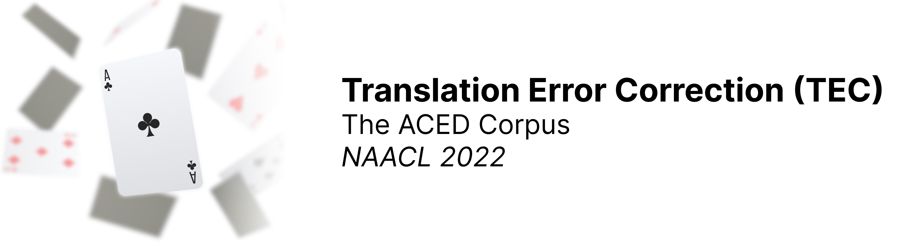

---

This repository contains the official data and evaluation code for the NAACL 2022 paper:

**Automatic Correction of Human Translations**<br/>
Jessy Lin, Geza Kovacs, Aditya Shastry, Joern Wuebker, and John DeNero<br/>
[[arXiv]](https://arxiv.org/abs/2206.08593)

## The ACED Corpus

You can load the corpus directly from the `data/` directory. The corpus consists of three translation error correction datasets from different domains: `asics` (marketing), `emerson` (technical), and `digitalocean` (technical). For more information on the data, please refer to our paper.

Each directory contains the train, dev, test data, with the following files for each:
```
  .src: English source sentence (s)
  .pert: original German translation (t)
  .tgt: corrected German translation (t') 
```

## Evaluation

To install the (minimal) dependencies for evaluation, we recommend setting up a virtualenv:
```
conda create -n tec python=3.8
pip install -r requirements.txt
```

#### Precision, Recall, and F-scores with MaxMatch

To calculate precision, recall, and F-scores, we use the `errant` toolkit to generate and compare
MaxMatch (M2) files. 

You can evaluate a model output file (one sentence per line) by running:
```
sh eval_m2.sh <dataset> <split> /path/to/model/output.tgt 
```
where dataset is one of `{asics, cricut, digitalocean}` and split is one of `{dev, test}`. This script generates the gold and hypothesis m2 files
and outputs the precision, recall, and F-0.5 scores with `errant_compare`.

#### GLEU

The scripts to evaluate models on the GLEU metric were adapted from the following repo: [https://github.com/cnap/gec-ranking](https://github.com/cnap/gec-ranking)

You can evaluate a model output file (one sentence per line) by running:
```
sh eval_gleu.sh <dataset> <split> /path/to/model/output.tgt
```

#### Sentence-level Accuracy

Error labels are provided for the ASICS test set. You can evaluate the per-category sentence-level accuracy by running:
```
sh eval_sentence_level.sh /path/to/model/output.tgt
```

## Reference

```
@inproceedings{lin2022automatic,
  title={Automatic Correction of Human Translations},
  author={Lin, Jessy and Kovacs, Geza and Shastry, Aditya and Wuebker, Joern and DeNero, John},
  booktitle={{NAACL}},
  year={2022}
}
```

## Acknowledgements

We use code from the following repositories for our evaluation:
- [moses](https://github.com/moses-smt/mosesdecoder)
- [errant](https://github.com/chrisjbryant/errant)
- [gec-ranking](https://github.com/cnap/gec-ranking)
